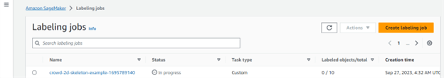
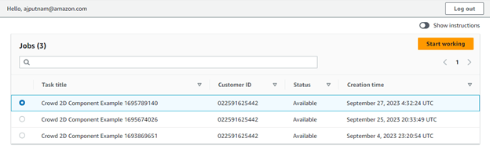
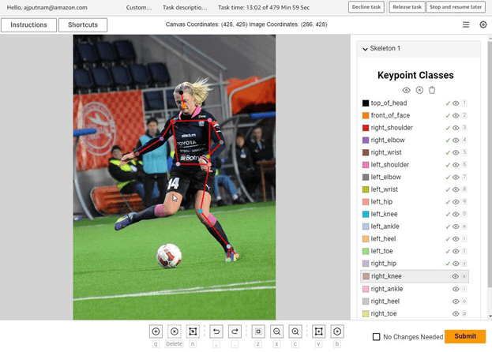

# Launching Example Labeling Jobs
This documentation will walk you through how to launch a crowd-2d-skeleton
various labeling jobs programmatically.

The overall process for each labeling workflow is as follows:
1) Download some example images from the internet
2) Create/update an input manifest file
3) Upload images and input manifest file to S3
4) Launch a labeling job

More details for each step can be found in the code as well as the documentation
below

###  Prerequisites

* [Python 3.9+](https://www.python.org/downloads/release/python-390/)
* You have completed the deployment steps outlined in the projects [README.md](../README.md)
* The ARN to [AWS SageMaker Ground Truth Private Workforce](https://docs.aws.amazon.com/sagemaker/latest/dg/sms-workforce-create-private-console.html) you wish to use

# Workflow 1: Keypoint Annotation (with skeleton / rig lines)
In this workflow the user wants to annotate points of interest on an image with
keypoint labels, however they also want to see the skeleton structure of how the
points are connected visually. This application supports this by drawing
pre-defined rig lines between keypoints annotation on an image. Generally, is
more useful than just keypoint labeling since the rig lines can be used to see
the overall objects structure which makes seeing typical labeling errors more
obvious.

## Step 1: Download the example images
Simply run:
```shell
python scripts/download_example_images.py
```
## Step 2: Create the labeling job
Run
```shell
create_example_labeling_job.py
```
## Step 3: Label the data
After you have launched the example labeling job it will appear in the AWS console as well as the workforce portal.

In the workforce portal, select the labeling job and click start working.

Once in the job you will be presented with an image from the example dataset.
At this point you can use the custom crowd-2d-skeleton UI (shown below) to
annotate the images. You can familiarize yourself with the crowd-2d-skeleton
UI by reading the crowd-2d-skeleton UI documentation found [here](https://github.com/aws-samples/sagemaker-ground-truth-crowd-2d-skeleton-component/blob/main/USER_GUIDE.md).

